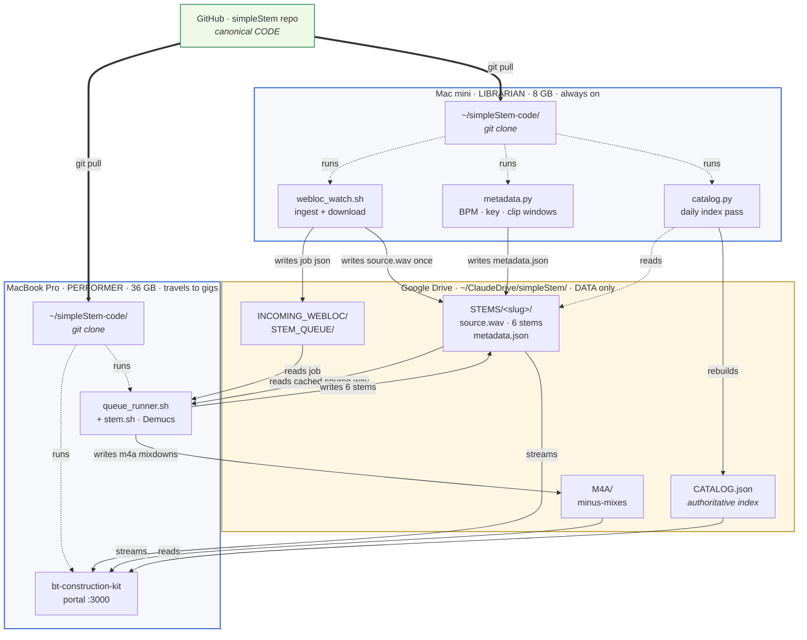
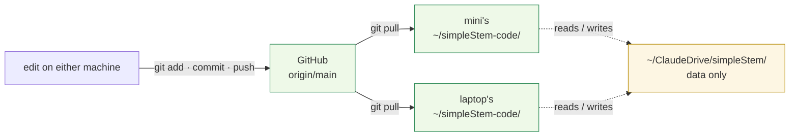
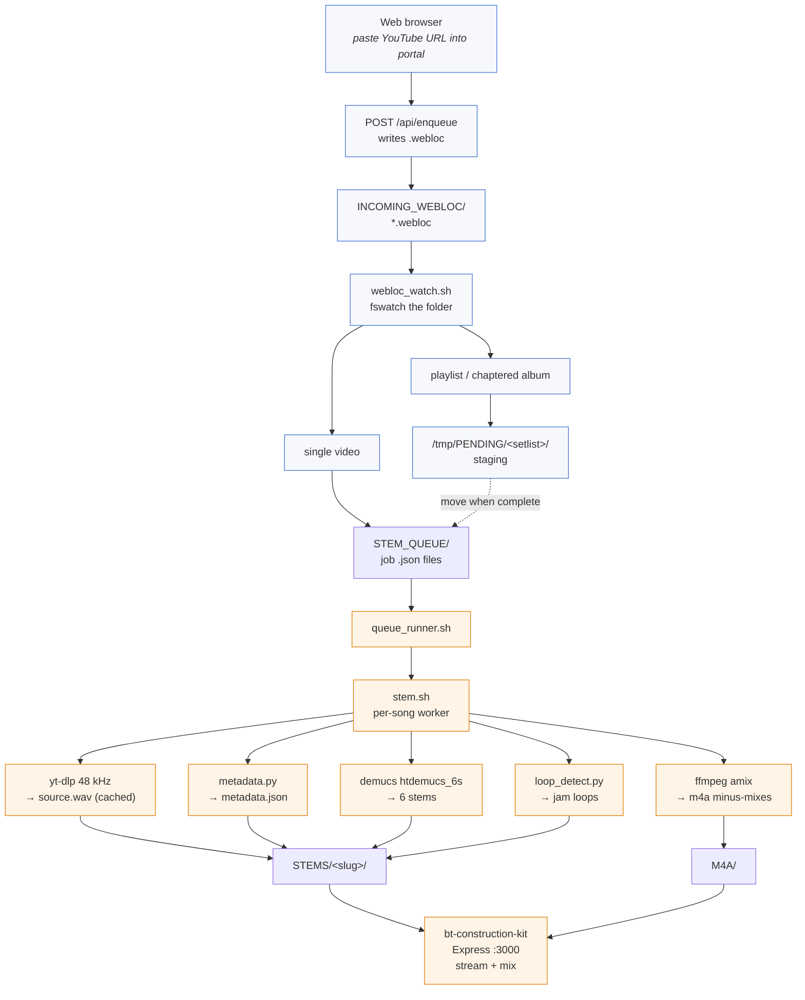

# simpleStem — architecture

This document is for forkers, developers, and the project owner refreshing
the design. It covers the two-machine model, the code/data separation, the
end-to-end pipeline, the data contracts, the code map, the optional Logic
Pro escape hatch, and operations.

If you're a bandmate using the portal, [USER_GUIDE.md](USER_GUIDE.md) is
the document you want instead.

---

## The page-1 picture



Two things to internalize from this diagram:

1. **Code lives in GitHub; data lives in Drive.** Neither machine clones
   the repo *into* Drive — both clone to `~/simpleStem-code/` on local
   disk. This is intentional: a previous setup had `.git` inside Drive
   and Drive's sync would race the git index and corrupt the repo.
2. **The two machines have non-interchangeable roles.** The Librarian
   never runs Demucs; the Performer never runs the ingest watcher. They
   share only the Drive data folder.

The rest of this doc unpacks each part.

---

## Why two machines

| Machine | Role | RAM | Uptime | Drive mode | Runs | Never runs |
|---|---|---|---|---|---|---|
| **Mac mini** | **Librarian** | 8 GB | 24/7 | mirrors Drive to external SSD | `librarian.sh` → `webloc_watch.sh` + daily `catalog.py` | Demucs |
| **MacBook Pro** | **Performer** | 36 GB | travels to gigs | streams Drive, pins active jobs | `performer.sh` → `queue_runner.sh` (Demucs) + portal | heavy ingest |

The split was reversed in May 2026 (commit `327ff83`). The original
arrangement had the mini running Demucs while the laptop served the
portal; Demucs ran the mini out of memory ("out of application memory"
crash). Moving Demucs to the 36 GB laptop fixed that, and let the mini
specialize in the lightweight 24/7 ingest work it was always better at.

**One implication:** the audio that backs every song crosses the network
exactly once, from YouTube to the Librarian's disk, then becomes
`STEMS/<slug>/source.wav` (the cache). The Performer reuses that cached
file rather than re-downloading from YouTube. The big audio never
touches the gig tether.

---

## Code/data separation and git workflow



**Rules:**

- Always work in `~/simpleStem-code/` (the git clone). Never edit code
  inside `~/ClaudeDrive/simpleStem/` — that folder is data-only now.
- Pull before editing, commit small, push immediately. The other machine
  pulls before its next edit.
- If `git push` complains about a stale `.git/index.lock` or
  `.git/HEAD.lock`, that's Drive sync residue from the older setup —
  `rm -f .git/index.lock .git/HEAD.lock .git/objects/maintenance.lock`
  and retry.

**What gets git-tracked:**

- All scripts (`*.sh`, `*.py`)
- `bt-construction-kit/` (Express server + static UI)
- Docs (`*.md`)
- Config (`Dockerfile`, `docker-compose.yml`, etc.)

**What's git-ignored:**

- `STEMS/`, `M4A/`, `STEM_QUEUE/`, `INCOMING_WEBLOC/` — runtime data
- `.run/` — pidfiles and logs
- `node_modules/` — npm
- `*.log`, `CATALOG.json` — derived state

---

## End-to-end pipeline

The full lifecycle of a song, from a pasted YouTube URL to playback in
the portal.



(Blue nodes run on the Librarian, orange on the Performer. Brown data
nodes live in Drive and are visible to both.)

### Stages

1. **Ingest** — the portal's "Add from YouTube" box (or any file dropped
   into `INCOMING_WEBLOC/`) becomes a `.webloc` plist. `webloc_watch.sh`
   classifies it: single video → one queue file; playlist or chaptered
   album → a staged setlist that gets moved into `STEM_QUEUE/` once
   every chapter is staged.
2. **Acquire source** — for single videos, the audio is downloaded at
   48 kHz and written to `STEMS/<slug>/source.wav` (the *cache*; never
   deleted). For album chapters, the whole album video is downloaded
   once and sliced per chapter.
3. **Metadata** — `metadata.py` writes `metadata.json` next to
   `source.wav` *before* Demucs runs, so BPM/key/release-date capture
   isn't lost if separation later fails. Idempotent.
4. **Render** — `queue_runner.sh` (on the Performer) picks up the job,
   sees `source.wav` already cached, and runs Demucs `htdemucs_6s` to
   produce `vocals.wav drums.wav bass.wav other.wav piano.wav
   guitar.wav`.
5. **Minus-mixes** — `ffmpeg amix` phase-inverts the unwanted stems
   and sums them onto the source, producing `<slug>_-V.m4a`,
   `<slug>_-V-G.m4a`, `<slug>_-V-G-B.m4a`, and drums-only
   `<slug>_DO.m4a` in `M4A/`.
6. **Loops** — `loop_detect.py` segments `source.wav` by recurrence
   and tiles the most-repeated sections out of each rhythm stem at
   bar boundaries, producing up to 4 loops per stem.
7. **Serve** — `bt-construction-kit` reads `STEMS/`, `M4A/`, and each
   song's `metadata.json`; streams audio through `/api/audio/...`
   endpoints with a local cache at `~/.bt-cache`.

---

## The cache: `source.wav` is fetched once

A small but important design property: YouTube is contacted exactly
once per song. The Librarian downloads `source.wav` into
`STEMS/<slug>/source.wav` (where `stem.sh` already looks for an
existing source); the Performer reuses it without re-fetching.

For chaptered "full album" videos, the album is downloaded once and
each chapter is sliced to its own per-song `source.wav` cache. (Earlier
versions re-downloaded the whole album once per chapter — N times the
bandwidth.)

The benefit: at a gig, the laptop tether never hits YouTube. All audio
is already in Drive, and the portal serves from the on-disk
`~/.bt-cache` mirror.

---

## CATALOG.json — the shared index

`CATALOG.json` is the authoritative library index: title, artist, BPM,
key, available renditions (stems + each m4a variant), status per song.
It is **derived data** (rebuilt from `STEMS/` and `M4A/` on every poll),
which means it belongs in Drive next to the data it indexes — not in
the git repo. Authoritative path:

```
~/ClaudeDrive/simpleStem/CATALOG.json
```

The Librarian's `catalog.py` rebuilds it on its daily pass (and on
demand via `librarian.sh catalog`). The Performer reads it from the
same Drive path to render the portal library without having to scan
hundreds of song directories itself. Drive sync propagates updates
across the two machines transparently — no `git pull` needed for
catalog changes.

> Implementation note: `catalog.py` and the portal currently still
> point at the code-repo root for `CATALOG.json`. Migrating both to
> the Drive path is on the open-items list below. Until that's done,
> the portal scans `STEMS/` and `M4A/` directly each request (cached
> in memory) — slower than reading the index, but functionally
> correct.

---

## Data contracts

These are the producer/consumer agreements between scripts. **Change
both sides together** — the portal and the pipeline tools need to
agree on shape.

### `metadata.json` (per song)

Producer: `metadata.py`. Consumer: `bt-construction-kit/server.js`.

```json
{
  "title": "Harvest Moon",
  "artist": "Neil Young",
  "youtube_title": "Neil Young - Harvest Moon (Official Music Video)",
  "youtube_uploader": "NeilYoungChannel",
  "release_date": "1992-10-27",
  "source_url": "https://www.youtube.com/watch?v=...",
  "version": "studio",
  "duration_sec": 300,
  "clip_start_sec": null,
  "clip_end_sec":   null,
  "bpm": 112.7,
  "key": "D major",
  "key_signature": "2 sharps",
  "lyrics_search_url": "https://www.google.com/search?q=...",
  "chords_search_url": "https://www.ultimate-guitar.com/search.php?...",
  "processing": {
    "download":   { "sample_rate_hz": 48000, ... },
    "separation": { "model": "htdemucs_6s", ... },
    "mixdowns":   [ "-V", "-V-G", "-V-G-B", "DO" ]
  },
  "playlist_title":    "(setlist members only)",
  "sequence_number":   1,
  "generated_at": "2026-05-25T19:52:00Z"
}
```

`clip_start_sec` / `clip_end_sec` are non-null only for songs sourced
from a chaptered album video — they describe the window within the
album that became this song's `source.wav`.

### M4A naming

`<SlugTitle>_<SlugArtist>_<suffix>.m4a` in `M4A/`.

| Suffix | Contents |
|---|---|
| `_-V` | source minus vocals |
| `_-V-G` | source minus vocals, guitar |
| `_-V-G-B` | source minus vocals, guitar, bass |
| `_DO` | drums only |
| *(none)* | full mix (alias "FULL" in the UI) |

The portal's library scanner ignores ` (N)` duplicate copies that
Drive's sync sometimes drops.

### Slugs

ASCII alphanumeric + `_` / `-` only. Spaces and punctuation collapse
to `_`; runs of `_` collapse; leading/trailing `_` are trimmed. Both
`stem.sh` (bash) and `mpbbatch.bash` use the same `slugify` function
so existence checks line up.

### Setlist files

`STEM_QUEUE/<setlist>/NN_<slug>.json` where `NN` is a zero-padded order
prefix. Each member's `metadata.json` carries `playlist_title` and
`sequence_number`.

---

## Code map

### Pipeline (Librarian + Performer)

| File | Role |
|---|---|
| `webloc_watch.sh` | fswatch loop on `INCOMING_WEBLOC/`. Classifies single video vs playlist vs chaptered album; writes job JSON to `STEM_QUEUE/` and `source.wav` to `STEMS/<slug>/`. Librarian only. |
| `metadata.py` | Per-song BPM (librosa beat tracking), key (Krumhansl-Schmuckler), version detection (live/studio/cover/karaoke from YouTube title), MusicBrainz release date, lyric/chord search URLs, clip windows for album chapters. Idempotent. |
| `queue_runner.sh` | Consumes `STEM_QUEUE/`. One at a time; holds `STEM_QUEUE/.runner.lock`. For album chapters: downloads the full video, slices the clip window, then stems. Publishes current job + phase to `STEM_QUEUE/.current` for the portal. Moves finished → `_done/`, failed → `_failed/`. Performer only. |
| `stem.sh` | The heavy worker. Source acquisition → 48 kHz `source.wav` → Demucs `htdemucs_6s` → ffmpeg m4a mixdowns → loop detection. Idempotent at every step. |
| `loop_detect.py` | Beat-synced agglomerative segmentation of `source.wav`; tiles the most-repeated sections of each rhythm stem to song length at bar boundaries. |
| `post_process.py` | Optional LSQ gain match between stems and source. Not auto-invoked; run by hand for stem rebalancing. |
| `catalog.py` | Daily Librarian pass: rebuild `CATALOG.json` from `STEMS/` and `M4A/`; fill metadata gaps via MusicBrainz; compute missing BPM/key locally; flag (don't overwrite) drift between dirs and `metadata.json` files. |
| `batch.bash`, `mpbbatch.bash` | Older Google-Sheet batch path. Pulls Song/Artist rows from a public sheet and runs `stem.sh` per row. Largely superseded by the webloc/queue flow. |
| `Dockerfile`, `docker-compose.yml`, `entrypoint.sh` | Containerized `stem.sh` / `mpbbatch` runs. Bundles ffmpeg/yt-dlp/demucs. |

### Control scripts

| File | Role |
|---|---|
| `librarian.sh` | `start \| stop \| restart \| status \| logs \| catalog`. Runs `webloc_watch.sh` and the daily `catalog.py`. Librarian only. |
| `performer.sh` | `start \| stop \| restart \| status \| logs`. Runs `queue_runner.sh` and the portal. Performer only. |
| `studio.sh` | Legacy single-machine control (pre-split). Still works for "ingest + render + serve on one Mac"; prefer the split scripts. |
| `rebuild.sh` | Staged full rebuild (dry-run by default; `--go` to execute). |
| `install.sh` | One-shot prereq installer (Homebrew → pipx → demucs + injects). |

### Portal (Performer only)

| File | Role |
|---|---|
| `bt-construction-kit/server.js` | Express 5 server on `:3000`. Endpoints below. |
| `bt-construction-kit/public/index.html` | Single-page UI shell. |
| `bt-construction-kit/public/app.js` | Library rendering, player wiring, stem mixer, setlist planner, song-options modal, KBM trigger. |
| `bt-construction-kit/public/styles.css` | Light-theme high-contrast styling for stage use. |
| `bt-construction-kit/public/visualizer.js` | Waveform / spectrum display. |

### Express endpoints

| Verb | Path | What |
|---|---|---|
| `GET` | `/api/library` | Cached library scan: stems, m4as, metadata per song, format chips. |
| `GET` | `/api/library-uncached` | Forces a fresh scan, bypassing the in-memory cache. |
| `GET` | `/api/audio/stems/:song/:file` | Stream one stem file; transparent disk cache to `~/.bt-cache`. |
| `GET` | `/api/audio/m4a/:file` | Stream one m4a; same cache. |
| `POST` | `/api/precache/stems/:song` | Pre-warm the disk cache for one song. |
| `POST` | `/api/precache/setlist/:slug` | Pre-warm an entire setlist. |
| `GET` | `/api/cache-status` | Per-song "is fully cached" state. |
| `POST` | `/api/enqueue` | Drop a `.webloc` into `INCOMING_WEBLOC/`. |
| `GET` | `/api/queue` | Live queue status (incoming → queued → rendering). |
| `GET` | `/api/setlists`, `GET /api/setlists/:slug`, `POST /api/setlists` | Setlist CRUD. |
| `GET` | `/api/version`, `POST /api/update` | Self-update: file-mtime versioning, restart on drift. |
| `GET` | `/api/song/:base/metadata` | Per-song metadata + artifact summary. |
| `POST` | `/api/song/:base/refetch` | Wipe artifacts; re-ingest from a new URL. |
| `POST` | `/api/song/:base/logic-restem` | Trigger the optional Logic Pro re-stem macro (see below). |
| `POST` | `/api/logic-restem/unlock` | Manual escape hatch for a stuck Logic re-stem lock. |
| `DELETE` | `/api/song/:base` | Two-click deletion of a song's stems + m4as + metadata. |

---

## Optional: Logic Pro re-stem via Keyboard Maestro

A per-song escape hatch for when Demucs's separation isn't good enough.
The portal's `⋯` menu has a "Re-stem in Logic" button that hands the
song off to a Keyboard Maestro macro on the Performer, which drives
Logic Pro's Stem Splitter and bounces replacement m4a mixdowns into
the same `M4A/` directory with the same filenames. The demucs path is
unchanged; Logic is purely an opt-in upgrade per song.

### Trigger flow

```mermaid
sequenceDiagram
    autonumber
    participant UI as Portal (browser)
    participant SRV as server.js
    participant KBM as KBM Engine
    participant LOGIC as Logic Pro
    participant FS as M4A/

    UI->>SRV: POST /api/song/:base/logic-restem
    SRV->>KBM: osascript (atomic check + set 17 vars + Running=base)
    KBM-->>SRV: "" (lock acquired)
    SRV->>KBM: spawn(open kmtrigger://macro=simpleStem) — detached
    SRV-->>UI: 200 OK (returns in <1s)
    KBM->>LOGIC: open source.wav, run Stem Splitter
    LOGIC->>KBM: 4 stems available
    KBM->>FS: bounce <base>_-V.m4a, _-V-G.m4a, _-V-G-B.m4a, _DO.m4a
    KBM->>KBM: set simpleStem_Running = "" (release lock)
    Note over UI,FS: Macro takes ~3 min; UI is responsive throughout
```

### Why it's non-blocking

The earlier version used `execFileSync('osascript', ['-e',
'tell app "Keyboard Maestro Engine" to do script "simpleStem"'])`.
`do script` blocks until the macro finishes; AppleScript's default
per-event timeout is 120s; the macro takes ~180s. Result was a
guaranteed `-1712 AppleEvent timed out`. The current shape uses
KBM's `kmtrigger://` URL scheme via detached `spawn('open', ...)`,
which returns in ~50ms regardless of macro length.

### The KBM-side lock

`simpleStem_Running` is a KBM Engine variable used as the only source
of truth for "Logic is busy." Server sets it atomically along with the
song's variables; macro clears it at exit. Concurrent triggers see
`Running != ""` and get back 409 Conflict.

Escape hatches when the macro fails to clear the lock: `POST
/api/logic-restem/unlock` or restart KBM Engine (resets all engine
variables).

### Variables passed to the macro

All prefixed `simpleStem_`. Paths: `SourceDir`, `SourceWav`, `M4ADir`,
`M4ABase`. Identity: `Title`, `Artist`, `Version`, `SourceUrl`.
Musical metadata: `BPM`, `Key`, `KeySignature`, `Duration`, `Bars`
(ceil of BPM × Duration / 240, 4/4 assumed), `ClipStartSec`,
`ClipEndSec`. References: `LyricsUrl`, `ChordsUrl`. Lock: `Running`.

The macro **must** clear `simpleStem_Running` at exit (success and
error paths). Full contract is documented in the comment block above
the endpoint in `server.js`.

---

## Operations

### Starting and stopping

On the **Librarian** (mini):

```
cd ~/simpleStem-code
./librarian.sh start      # watcher + daily catalog poll
./librarian.sh catalog    # run the consistency pass now
./librarian.sh status
./librarian.sh logs
./librarian.sh stop
```

On the **Performer** (laptop):

```
cd ~/simpleStem-code
(cd bt-construction-kit && npm install)   # once
./performer.sh start      # queue runner (Demucs) + portal
./performer.sh status     # queue depth + current render + phase
./performer.sh logs runner
./performer.sh restart    # picks up new git pulls
./performer.sh stop
```

Both scripts track PIDs and logs in `.run/`, tree-kill children, and
clear the runner lock.

### Render phases (visible in `status` and the portal)

```
downloading source → analyzing (BPM/key) → separating stems · demucs → mixing m4a
```

Demucs is ~10–25 min/song on CPU. A new request just queues behind the
current song.

### Drive sync friction

If a git command complains about `.git/index.lock`, `.git/HEAD.lock`,
or `.git/objects/maintenance.lock`, that's leftover from when the repo
was inside Drive:

```
rm -f .git/index.lock .git/HEAD.lock .git/objects/maintenance.lock
```

The fix is permanent: keep `~/simpleStem-code/` outside Drive on both
machines (already the case post-`327ff83`).

### Hard-coded paths

`bt-construction-kit/server.js` resolves `SIMPLE_STEM_ROOT` in this
order:

1. `process.env.SIMPLE_STEM_ROOT` (set by `performer.sh`)
2. `~/ClaudeDrive/simpleStem`
3. `~/Library/CloudStorage/GoogleDrive-*/My Drive/ClaudeDrive/simpleStem`

If username/mount differs from this fallback, set the env var.

---

## Constraints and gotchas

- **Demucs RAM:** several GB. The 8 GB mini crashes; the 36 GB laptop
  is fine. This is why the role split exists.
- **One `queue_runner.sh` at a time:** it holds
  `STEM_QUEUE/.runner.lock`. Run it on the Performer only.
- **Drive streaming latency:** first play of an uncached file on the
  Performer streams from Drive and can take a few seconds; the
  `~/.bt-cache` mirror covers subsequent plays.
- **4/4 assumed throughout:** `loop_detect.py` and the Logic re-stem
  `Bars` computation both assume four beats per bar. Songs in 3/4 or
  6/8 will have wrong bar counts (audio is still correct).
- **YouTube TOS:** downloading is technically against TOS. This is for
  personal band-practice use.
- **Section labeling is recurrence-only:** `loop_detect.py` ranks
  clusters by how often a section repeats, not by musical role. Don't
  trust loop1 to be the chorus — it usually is, but not always.

---

## Roadmap

**Built and working:** webloc watcher; metadata generation (incl. clip
windows and the processing spec); queue runner; portal enqueue + live
queue status; the two-machine split; library cleanup + scanner
hardening against ` (N)` duplicates; Logic Pro re-stem hand-off with
KBM-side lock; non-blocking trigger.

**Next (deferred "feature 2") — progressive live playback for low
bandwidth:**

- Have `stem.sh` also export a small full-mix m4a, and emit the `-V`
  mixdown (the `processing` spec already lists `-V`; current
  `stem.sh` writes only `-V-G`, `-V-G-B`, `DO`).
- Reorder `stem.sh` to produce the small m4a files **before** the
  slow stems.
- Client ladder: full mix instantly → swap to `-V` → `-V-G` as each
  small file arrives → 6 stems in the background. The portal's
  `app.js` already hot-swaps variants and precaches; this extends
  the ladder and ordering.

**Other open items:**

- **Library inconsistency surface in the portal.** `catalog.py`
  already detects drift (orphan audio files, naming-convention
  violations, dirs without `metadata.json`, m4as without a matching
  STEMS dir, " (N)" duplicate copies left by Drive sync, etc.) but
  the flags sit in `CATALOG.json` / logs where nobody sees them. Add
  a "Library hygiene" panel to the portal that lists each anomaly
  with the full Drive path and a small "Reveal in Finder" hint, so
  the user can drag the offending files to the Trash directly from
  Finder. Deliberately *not* in-portal delete — the goal is for the
  user to eyeball each file before it goes. The Librarian writes
  the flags; the Performer just renders them.

- **Migrate `CATALOG.json` to the Drive path.** `catalog.py` and the
  portal both still point at the code-repo root for the catalog;
  move both to `~/ClaudeDrive/simpleStem/CATALOG.json` so Drive sync
  propagates updates without requiring a `git pull`. See the
  "CATALOG.json — the shared index" section above.

- **Time-signature detection in `metadata.py`** so the `Bars`
  computation that feeds the Logic re-stem macro can drop the
  hard-coded 4/4 assumption.

- **Per-song "open in Logic" macros beyond re-stem** — transpose,
  time-stretch to a practice tempo, click-track generation. Each is
  a separate KBM macro with its own export filename suffix; same
  metadata variables flow in.

---

## Pointers

- Bandmates → [USER_GUIDE.md](USER_GUIDE.md)
- AI coding agents → [CLAUDE.md](CLAUDE.md) (project-specific rules
  the coding agent reads on every session)
- GitHub repo → <https://github.com/williambnorton/simpleStem>
