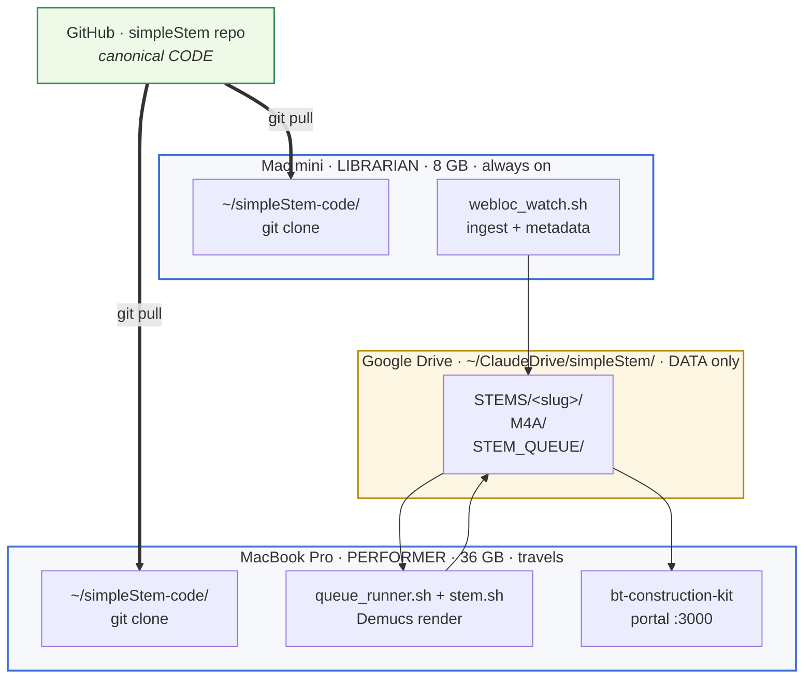

# simpleStem

A band backing-track system. Turns YouTube songs into separated stems
(vocals · drums · bass · guitar · piano · other) plus drop-in practice
mixes ("source minus vocals", "drums only", etc.), and serves them
through a web studio you load setlists into for rehearsal and live use.

Built for and around the New Mitchell Park band. Two Macs share the
work: a Mac mini (Librarian) ingests and indexes; a MacBook Pro
(Performer) renders the stems and serves the portal on stage.

---

## The shape of the system



Code lives in GitHub. Both machines clone it onto local disk under
`~/simpleStem-code/`. Drive holds only the data (song folders, queue,
m4as). The machines never share code; they only share the data folder.

Two-machine split exists because Demucs needs several GB of RAM and the
8 GB mini crashed running it. The 36 GB laptop owns Demucs; the mini
owns 24/7 ingest. Audio is fetched from YouTube **once** (on the mini,
into the cache) and reused by the laptop — the gig tether never hits
YouTube.

---

## Where to go from here

**If you're a bandmate using the portal** —
[USER_GUIDE.md](USER_GUIDE.md) walks through adding a song, finding
songs, the stem mixer, loops, and setlist planning. No internals.

**If you're a developer / forker / project owner** —
[ARCHITECTURE.md](ARCHITECTURE.md) covers the two-machine model, the
end-to-end pipeline, data contracts (`metadata.json`, M4A naming,
slugs), the code map, all Express endpoints, the optional Logic Pro
re-stem hand-off, operations, and the roadmap.

**If you're an AI coding agent** — [CLAUDE.md](CLAUDE.md) is the
project-specific guide loaded automatically each session.

---

## Quick start

### Install

```
./install.sh
```

Installs Homebrew prereqs (ffmpeg, yt-dlp, pipx), then demucs into a
pipx venv with torch / torchcodec / librosa / soundfile. Idempotent —
re-run if anything is missing.

### Run

```
cd ~/simpleStem-code
(cd bt-construction-kit && npm install)   # once

# Librarian (mini)
./librarian.sh start         # watcher + daily catalog poll

# Performer (laptop)
./performer.sh start         # queue runner (Demucs) + portal at :3000
```

Then open <http://localhost:3000>, paste a YouTube URL into "Paste a
YouTube URL", and click Add. Render takes 10–25 min per song; the
portal stays responsive while it cooks.

For non-developers, see [USER_GUIDE.md](USER_GUIDE.md). For the
single-machine legacy path or the Docker setup, see
[ARCHITECTURE.md](ARCHITECTURE.md).

---

## License

Personal project for the New Mitchell Park band. YouTube downloading is
technically against TOS — used here for personal practice and live use.
