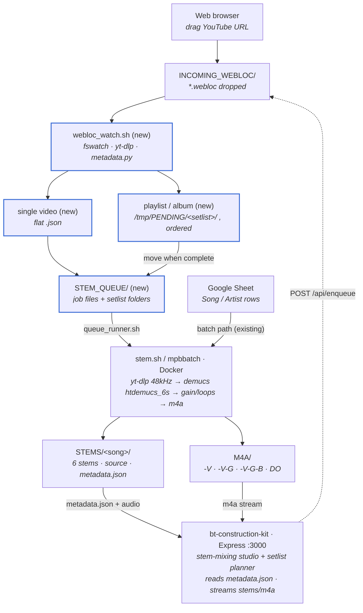

# simpleStem workflow

From a YouTube URL to playable backing tracks. Nodes marked **(new)** were added
in the recent webloc-watcher work. The web front-end is `bt-construction-kit/`
(Express server, now in this repo).

## Notes

- A `.webloc` carries one YouTube URL. `webloc_watch.sh` classifies it:
  - **single video** → one `STEM_QUEUE/<slug>.json`
  - **playlist (`list=`)** or **chaptered "full album"** → a setlist: one file
    per song staged in `/tmp/PENDING/<setlist>/`, moved into `STEM_QUEUE/<setlist>/`
    only once every song is written.
- Each job JSON is self-contained: BPM, key, version, year, lyric/chord URLs,
  `clip_start_sec`/`clip_end_sec` (for album chapters), and a `processing` block
  specifying the 48 kHz download, `htdemucs_6s` 6-stem split, and the four m4a
  mixdowns.
- **Queue runner (built):** `queue_runner.sh` consumes `STEM_QUEUE` and runs
  `stem.sh` per job — for album chapters it downloads the full video and slices
  the `clip_start_sec`/`clip_end_sec` window before stemming. Finished jobs move
  to `STEM_QUEUE/_done/`, failures to `_failed/`; the current job is written to
  `STEM_QUEUE/.current` for the portal. Run it alongside `webloc_watch.sh`.
- **Portal enqueue (built):** the studio's "Add from YouTube" box POSTs to
  `/api/enqueue`, which drops a `.webloc` into `INCOMING_WEBLOC`; `/api/queue`
  reports live status (awaiting metadata → queued → rendering).
- **Front-end** — `bt-construction-kit/` (Express v5 + cors, `server.js`, port
  3000; static UI in `public/`). It scans `STEMS/` and `M4A/`, reads each song's
  `metadata.json` (title/artist/bpm/key/duration) for `/api/library`, and streams
  audio via `/api/audio/stems/:song/:file` and `/api/audio/m4a/:file`, caching to
  `~/.bt-cache`. Read-only consumer of the pipeline's output and metadata. Start
  it with `start_server.bash` (currently points at an old path — update it to
  `cd .../simpleStem/bt-construction-kit && node server.js`).
