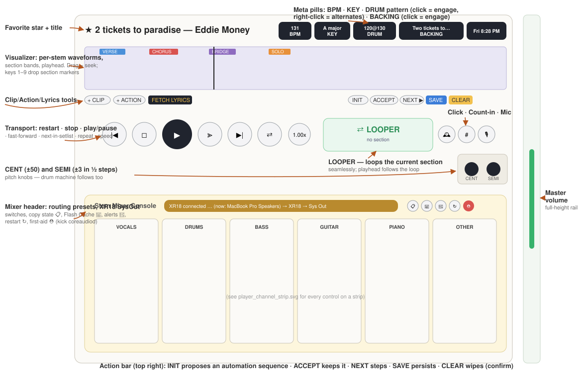
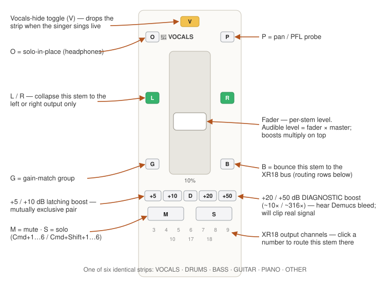

# Player reference

Every control on the player surface, region by region, named by its
on-screen label or tooltip. Hover any button in the portal for the same
text — the tooltips are the single source of truth and this document
follows them.


*SCREENSHOT: full player surface with each region outlined and numbered — header row, visualizer, action bar, timeline, transport, LOOPER + pitch, mixer console, master rail*

## 1. Title and meta pills row

The top row of the player identifies the song and carries the playback-mode
pills.

- **☆ star** — favorite toggle for the loaded song. Filled ★ = favorited.
  The same star appears in the library row and the setlist sidebar; all
  three stay in sync.
- **Title — Artist** — the loaded song.
- **Drum Machine banner** — appears only while the drum machine is engaged:
  *"Drum Machine playing — press Play to switch back to the song."*
- **BPM pill** — the song's detected tempo.
- **Key pill** — detected key plus key signature.
- **Drum pill** — the drum-machine toggle. Tooltip: *"Left-click: drum
  machine ↔ backing track. Right-click: pick another pattern."* The value
  shown is the pattern file the server picked — the song's explicit
  `drum_pattern` if the band sheet set one, otherwise the metronome pattern
  closest to the song's BPM. Right-click opens the list of nearby patterns
  with the current one marked; picking one swaps it for this session
  without touching the song's saved metadata.
- **Backing pill** — plays the pre-mixed stereo backing track instead of
  the six stems. Tooltip: *"Left-click: play backing-track m4a instead of
  stems."* Enabled only when a backing track is matched to the song.
  Mutually exclusive with the drum pill.
- **Digital clock pill** — local date and time, sized to match the other
  pills so you can keep an eye on set timing.
- **Collapse player (chevrons-up)** — *"Collapse player (show more of the
  song list)."* Shrinks the whole player to just the title/BPM/key line.

The playback mode implied by the pills (stems / drum / backing) is
**remembered per song** across sessions.


*SCREENSHOT: close-up of the pill row with the drum pill engaged and its right-click alternates menu open*

## 2. Source variant picker

When a song exists in more than one form (stems plus legacy m4a variants),
a **Source:** chip row appears under the header. Click a chip to switch
which rendition is loaded. Most songs are stems-only and never show this.

## 3. Visualizer

- **SUM / STEMS toggle** (top-left of the canvas) — *"Toggle between summed
  waveform and 6 per-stem lanes (V/D/B/G/P/O top→bottom)."* SUM shows one
  combined waveform; STEMS splits the canvas into six lanes, each colored
  to its strip — much better for spotting entries and drops when teaching a
  part. The choice persists.
- **Zoom controls** (top-right overlay): **−** zoom out, **1×** badge
  (click to reset), **+** zoom in. Double-click the waveform to zoom in at
  that point; right-click resets to 1×. Sections, markers, and the
  playhead all stretch with the zoom so everything shares one time axis.
- **Buffering overlay** — if stems are slow to load you'll see *"Buffering
  Audio…"* with a **Play Anyway** button: *"Stop waiting; start with
  whatever has buffered."* (If you see this at all on cached songs,
  something is wrong — see [09_TROUBLESHOOTING.md](09_TROUBLESHOOTING.md).)

### Sections

Sections are the colored bands overlaid on the visualizer. While a song
plays (or is paused anywhere), press a **number key 1–9** to drop a section
divider at the playhead. Each number has a color and a default name:

| Key | Name | Key | Name | Key | Name |
|---|---|---|---|---|---|
| 1 | Intro (green) | 4 | Bridge (purple) | 7 | Outro (teal) |
| 2 | Verse (blue) | 5 | Solo (orange) | 8 | Break (gray) |
| 3 | Chorus (red) | 6 | Pre (yellow) | 9 | Tag (pink) |

- Placement **snaps** to an auto-detected boundary within ±2 seconds (the
  faint vertical ticks show where the detector thinks sections start);
  otherwise it snaps to the BPM grid.
- **Drag** a divider to move it. **Click** a section label to rename or
  recolor it via the picker. Delete a divider with its **×** or a
  right-click; the previous section absorbs the gap.
- Sections drive the LOOPER, the **Skip to next section** transport button,
  and Cmd+J / Cmd+Shift+J jumps.

### Actions lane

The lane over the waveform also holds **action markers** — MIDI events,
clip triggers, lyric lines, and mixer changes that fire as the playhead
crosses them. Lane tooltip: *"Drag a divider to move it. Click x or
right-click a divider to delete. Use + Action below to add an action at
the playhead."*


*SCREENSHOT: visualizer in STEMS mode with section bands, candidate ticks, and two action markers*

## 4. Action bar

The row directly under the visualizer. Left side — adding things at the
playhead:

- **+ Clip** — *"Drop a Play Clip action at the playhead. Pick a clip and
  choose whether the clip STARTS at the playhead or ENDS at the playhead."*
  Opens a small picker: clip dropdown (from the Clip Library), anchor mode,
  a **Boost** menu (0 / +5 / +10 / +15 / +20 dB for quiet clips), and an
  optional label.
- **+ Action** — *"Open the Action editor pre-filled at the current
  playhead position."* The full editor: device (Helix / Logic Pro (IAC) /
  XR18), type (Program Change, CC, Note On/Off, Mute/Unmute stem, Play
  clip), channel, values, label, and a **Test send** button.
- **+ Lyric** — *"Drop the next cached lyric line at the playhead. Tap
  multiple times within 2s to stack; tap after >2s to replace. Right-click
  to re-open the lyrics editor."* The first press fetches lyrics — the
  dialog offers search buttons (Google / Ultimate Guitar / AZLyrics) and a
  paste box for when the automatic lookup comes up empty. Each following
  press drops the next line at the playhead: the tap-along workflow.
- **Show Lyrics** — toggles the lyrics overlay; only visible once the song
  has lyric actions placed. (Keyboard: **Cmd+Shift+/**.)

Right side — managing the timeline as a whole:

- **counter** — how many actions are on this song's timeline; a **●** dot
  appears when there are unsaved changes.
- **INIT** — *"Capture the current mixer state as the song's initial state
  — also clears every other action on the timeline."* Set your faders,
  mutes, and routing the way the song should start, then press INIT.
- **ACCEPT** — *"Drop a section marker at every auto-detected boundary
  (the faint ticks on the lane). Quick way to rough-in all sections;
  relabel/move/delete as needed."*
- **NEXT ▶** — *"Jump to the next library song that has zero saved
  sections — for working through the library in one sitting."*
- **SAVE** — *"Save all timeline actions to the song's metadata
  (auto-saves at song end)."*
- **CLEAR** — *"Remove every action on this song's timeline."* Red for a
  reason.


*SCREENSHOT: the action bar with the + Clip picker open*

## 5. Timeline

Current time, a scrub slider spanning the song, and total duration. The
slider is aligned with the waveform above so the playhead and the thumb
track together. **Cmd+→ / Cmd+←** nudge the playhead ±5 seconds.

## 6. Transport

Left to right:

- **⏮ Go to beginning of song**
- **■ Stop**
- **▶ Play / Pause** (Space)
- **⏭⏭ Skip to next section** — *"bypass solos / interludes"*
- **⏭ Next song in the active setlist** (Cmd+])
- **⟳ Toggle Looping** — plain whole-song loop
- **Playback Speed** — shows the current rate (e.g. `1.00x`); opens the
  speed popover: a 0.5×–1.5× slider plus presets **0.5x · 0.75x · 0.9x ·
  1x · 1.1x · 1.25x**. Pitch follows speed (this is a practice tool, not a
  time-stretch).

## 7. LOOPER, click, count-in, and voice control

The LOOPER card sits next to the transport:

- **LOOPER** — *"Loop the current section (defined by section markers);
  click again to play through."* While engaged, the button shows the
  section's name and time range, playback wraps seamlessly at the section
  boundary, and the playhead follows the loop. Move to a different section
  (or drag the divider) and the loop follows.
- **Click track** (alarm-clock icon) — *"Toggle click track (per-section:
  drives the section's click feel during playback)."* A click at song BPM
  for the current section; the count-in and click flags are stored on the
  **section**, not the whole song.
- **Count-in 4** (hash icon) — *"Count-in 4 beats for the current section
  before playback."* When engaged, pressing Play first plays four clicks
  at the song's BPM, **aligned so the fourth click lands right before the
  song's first real downbeat**. If the song has intro silence, the audio
  may start rolling under the count so the downbeat arrives exactly on
  beat 5 — trust the clicks. The setting saves with the song.
- **HOLODECK mic** — *"Click to start HOLODECK voice control."* Hands-free
  operation: with the mic engaged, say **"HOLODECK, …"** followed by a
  command — transport ("play", "stop", "next song"), mixer ("mute
  drums", "solo guitar"), sections, speed and pitch, and more. A small
  level meter under the icon confirms the room is being heard, and the
  HOLODECK Console panel shows what was recognized. Anything not prefixed
  with the wake word is ignored.


*SCREENSHOT: LOOPER engaged showing section name + range, click and count-in latched*

## 8. Pitch Fix — CENT and SEMI knobs

- **CENT** — fine pitch in cents (fractions of a half-step), **±50 cents in
  1-cent steps**. *"Drag up/down; double-click resets to 0."* The −/+
  steppers move 1 cent.
- **SEMI** — half-step pitch, **quantized to ½-step increments from −3 to
  +3** (13 stops). Drag, scroll, use the −/+ steppers, or arrow keys —
  every input snaps to the half-step grid. Double-click resets to 0.
- **RESET** — *"Zero both knobs — no pitch shift."* Pitch also resets when
  you load a different song.

The combined value drives every stem's playback rate, so tempo and pitch
move together by design. The ±3 cap is deliberate: it covers the band's
vocal-range needs while keeping the dial precise; anything bigger should be
a re-render.

## 9. Stem Mixer Console

Visible when a stems song is loaded. Six channel strips — **Vocals ·
Drums · Bass · Guitar · Piano · Other** — plus a header of mixer-level
controls.

### Mixer header

- **UNSOLO** — *"Click to drop every solo at once."* Appears only while at
  least one strip is soloed.
- **XR18 state badge** — live connection state from Web Audio's channel
  count: green **XR18 ACTIVE · 18 ch out** when the board is the default
  output; amber when the XR18 is connected but not the default output;
  red pulsing **XR18 ORPHANED** when the board has dropped to 2 channels.
  When the badge is not green, the routing buttons dim.
- **→ XR18** — *"Switch macOS default output to XR18 and reload the page so
  Chrome rebinds Web Audio to the new device. Does NOT touch the routing
  matrix — use this for quick A/B testing during XR18 recovery."*
- **→ Sys Out** — the same switch to *MacBook Pro Speakers*: *"use this to
  confirm the rest of the audio chain works while diagnosing an XR18
  problem."*
- **Snapshot (clipboard icon)** — *"Snapshot the full audio state (XR18
  probe, AudioContext, routing matrix, mixer state, per-strip gain) to the
  debug log so Claude can read it later. Click before AND after each
  diagnostic step so the log captures the transition."*
- **Flash Cache (hard-drive-download icon)** — *"FLASH CACHE — copy every
  song's six m4a stems from Drive into ~/.bt-cache so every song in the
  library plays end-to-end with NO wifi. Press this before leaving for a
  gig. Progress shows on the button itself; safe to repeat. Shift-click
  forces overwrite of existing cache files."*
- **Sound Check (bell icon)** — the round-the-horn channel check. It speaks
  *"Left, Right, One, Two, Three, Four, Five, Six"* onto XR18 outputs 1, 2,
  11, 12, 13, 14, 15, 16 in turn. If everything lands on the same speaker,
  the XR18's USB Sends/Returns map is sending all USB channels to Main LR —
  open X-Air → Setup → Routing → USB Sends/Returns and map USB 11–16 to six
  channel strips.
- **Restart (rotate icon)** — *"Restart the backend (performer.sh
  restart)."*
- **First aid (medical-briefcase icon)** — kicks the Mac's Core Audio
  daemon. Its tooltip IS the recovery ladder; the short form: **try a USB
  unplug/replug first**, then this button, then restart the backend, then
  power-cycle the XR18, then try a different cable/port. The full ladder,
  verbatim, is in the [Gig Day Runbook](08_GIG_DAY_RUNBOOK.md#the-first-aid-ladder).
- **Collapse (chevrons-up)** — *"Collapse mixer + visualizer; keep only
  title/BPM/key visible."*


*SCREENSHOT: mixer header with green XR18 ACTIVE badge and the seven header buttons labeled*

### Channel strips

Each strip is laid out as a compass around its fader, mirroring the stems'
positions on stage:

```
        V          (top — Vocals, ch 11)
   O  [fader]  P   (corners — Other ch 16 / Piano ch 15)
   L  [fader]  R   (sides — Stereo Left ch 1 / Right ch 2)
   G  [fader]  B   (corners — Guitar ch 14 / Bass ch 13)
  +5 +10 D +20 +50 (bottom — Drums ch 12, flanked by boosts)
        M  S
  3 4 5 6 7 8 9 10 17 18
```

- **Fader** — the strip's level. The percentage readout sits under the
  track. This is the only volume that matters; master and boost multiply
  on top of it.
- **Routing letters (V / D / B / G / P / O / L / R)** — each button routes
  this stem to one XR18 output channel and lights when active. Tooltip
  pattern: *"Route vocals stem to Drums (ch 12)"* etc. The letters are the
  named outputs — **V**ocals 11, **D**rums 12, **B**ass 13, **G**uitar 14,
  **P**iano 15, **O**ther 16, plus stereo **L**eft 1 and **R**ight 2. A
  stem can go to several outputs at once; by default each stem is routed
  to its own home channel. Buttons beyond the current device's channel
  count are disabled (grey) until an XR18 is the output.
- **Numeric row (3–10, 17–18)** — the remaining XR18 outputs, for anything
  unconventional (wedges, recorder feeds).
- **Boost buttons** — four latching gain trims flanking the D button:
  - **+5 / +10** — live mix shaping. *"Boost this strip by +5 dB. Click
    again to disable; mutually exclusive with other boost buttons."*
  - **+20 / +50** — diagnostic probes, styled as "extreme". *"Boost this
    strip by +20 dB (~10x gain). DIAGNOSTIC — will clip real signal. Use
    to hear faint bleed."* Use them to answer "what's actually in this
    stem?" — e.g. hearing Demucs leakage buried in the noise floor.

  All four are one mutually exclusive latch per strip: off → +N → off, and
  selecting any one releases the others. Boost never moves the fader and
  is never recorded into automation.
- **M / S** — mute and solo. Solo mutes everything else; multiple solos
  are allowed; **UNSOLO** in the header clears them all. Keyboard:
  **Cmd+1…6** mute, **Cmd+Shift+1…6** solo (V, D, B, G, P, O order).


*SCREENSHOT: one channel strip annotated — routing compass, boosts, M/S, numeric row*

## 10. Master volume rail

The thin rail on the far right edge: a full-height vertical **MASTER**
slider with a live percentage at the top. It scales every strip
proportionally — strip gain is always `fader × master × boost`.

## 11. Odds and ends

- **Scroll-to-top button (↑)** — floats bottom-right when you've scrolled
  into the library: *"Scroll back to the visualizer."*
- **Brand chip** (top of the sidebar) — `simpleStem` plus the
  **Performer · Librarian** view toggle (Cmd+Shift+U) and the build stamp
  (`V1.MMDDHHMM`). An **Update** button appears when newer code is on disk.
- **Tab bar** below the player: **Library · Setlist · Loop Library · Clip
  Library**. The Setlist tab hosts the AI Setlist Builder (describe the gig
  in prose, query chatbots, save the result as a manual setlist); the Loop
  Library and Clip Library tabs manage per-instrument loops and ad-hoc
  clips for the sampler.
