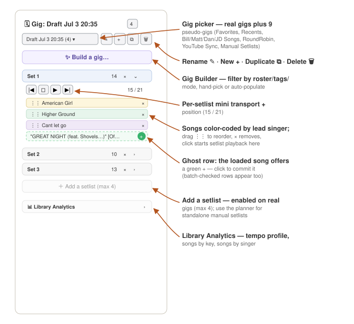

# Gigs and setlists

The portal organizes a performance around three nested levels, and the whole
UI follows this hierarchy:

```
Gig            (one per event)
 └─ Setlist    (1–4 per gig, ordered in time)
     └─ Song   (ordered; auto-advances during playback)
```

The **gig sidebar** (left column) always shows exactly one gig — the active
one — with its setlists as collapsible sections and the songs in order.
Switch gigs with the picker at the top.


*SCREENSHOT: the gig sidebar with an active gig expanded — picker, control buttons, two setlists with songs*

## The gig picker and the pseudo-gigs

The picker lists every real gig (Joyce, Sunday_Practice, the gigs synced
from the band's Google Sheet…) **plus nine synthetic "pseudo-gigs"** the
portal builds on the fly. Pseudo-gigs are pinned at the top, before the
real gigs. They exist only in the browser — no file on disk backs them.

| Pseudo-gig | Contents | Editable? |
|---|---|---|
| ▶ **YouTube Sync** | Every setlist that came from a YouTube playlist. | No — the playlist sync would overwrite edits. |
| ✎ **Manual Setlists** | Every setlist you saved by hand in the planner. | Yes — title and song-list edits persist. |
| ⟲ **Recents** | The last 50 songs you loaded, newest first. | No |
| ★ **Favorites** | Every song with the star turned on. | No |
| 🎤 **Bill Songs** | Every song where Singer = Bill, alphabetical. | No |
| 🎤 **Matt Songs** / **Dan Songs** / **JD Songs** | Same, per singer. | No |
| 🎙 **RoundRobin** | All singer-assigned songs, interleaved. | No |

**RoundRobin** shuffles each singer's bucket independently, then deals the
setlist in rotation — Bill → Matt → Dan → JD → Bill… — until every bucket
runs dry. It's built for the night a singer has to step out mid-set: the
next song never lands on the missing voice twice in a row.

To move a song out of a singer pseudo-gig, change its **Singer** either in
the band's Google Sheet (the canonical source) or with the in-row Singer
pulldown in the library (a quick fix the next sheet sync may overwrite).

In the **Manual Setlists** pseudo-gig, the "Add a setlist" button is
intentionally disabled — new standalone setlists are created from the
planner (its tooltip says so). Everything else there is editable.

## Managing gigs

The button strip next to the picker:

- **Rename (pencil)** — rename the active gig.
- **New (plus)** — create a fresh, empty gig and switch to it.
- **Duplicate (copy)** — *"Duplicate this gig (copies all setlists)"* —
  the fastest way to start next month's show from last month's.
- **Delete (trash)** — remove the gig (disabled for pseudo-gigs). Songs
  themselves are never deleted by gig operations; a gig is just a list.

Each **setlist** inside the gig has an inline-editable title, a delete
button (with confirmation), and its songs in order. **Drag** songs to
reorder or to move them between setlists in the same gig (hold **Alt**
while dragging to copy instead of move). Each song row shows a drag grip,
the title (color-coded by singer — Bill yellow, Matt green, Dan purple),
and an **×** to remove it from the setlist. A gig holds at most **4**
setlists — the "Add a setlist (max 4)" button disables at the cap.

## The Gig Builder

Click **Build a gig…** in the sidebar to open the Gig Builder — the fast
way to go from "who's coming Tuesday?" to four filled setlists.


*SCREENSHOT: the Gig Builder modal — filter row on top, filtered library left, four setlist columns right*

**Header row:** a gig **title** field, a running **"N min total"** counter,
and the action buttons — **AI populate**, **Clear**, **Accept**, and **×**
(discard the draft and close). Your filter choices and draft are saved
locally, so closing and reopening doesn't lose work.

**Filter row — who, why, what:**

- **Tonight** — checkboxes for the roster: Bill, Matt, Dan, JD, Mark,
  Joyce. Songs whose `Reqd` field needs someone who isn't checked drop out
  of the pool. (A song that needs a drummer stays visible without Mark if
  it has a drum-machine pattern to cover him.)
- **Presets** — one-click rosters: **Duo** (Bill+Matt), **Trio**
  (Bill+Matt+Dan), **Power Trio** (Bill+Matt+Mark), **Full**, **Full+Joyce**.
- **Purpose** — **Practice** shows songs still cooking (Rehearse + tbd);
  **Gig** shows stage-ready material (InTheCan + Rehearse).
- **Tags** — require any combination of tags (upbeat, slow, protest,
  harmonies, singalong, crowd, opener, closer, plus anything you've added).
- **Show** — filter by playback mode: 6STEMS / DRUM / BACKING / NONE.

**The filtered library** lists what survives: Title/Artist, **Sng**
(singer), **Req** (required members, compact — B M D J #), Key, Dur, **▶**
(play count), **Stale** (how long since it was last played), **Backing**
(the song's mode chip — click it to change the mode right here), and
**To set** — the **1 · 2 · 3 · 4 radios**. Click a radio and the song jumps
into that setlist and out of the pool.

**AI populate** fills the setlists for you: it distributes singers
round-robin and prefers songs that haven't been played in a while
(staleness scoring), within whatever filters you've set. You can then
hand-adjust before committing.

**Accept** saves the draft as a real gig and switches to it. **Clear**
empties the setlists; the **×** discards the draft without saving anything.

## Batch-adding songs — the ghost-add flow

From the library you can build a setlist in bulk:

1. Tick the **SET** checkbox on each library row you want.
2. Ghost rows appear in the active setlist in the sidebar, showing where
   the songs will land.
3. Click the **green +** on the ghost row to commit them all at once (or
   untick to back out).

Songs already in the setlist are marked so you don't double-add. There is
also the keyboard pair: **+** adds the currently loaded song to the active
setlist, **−** removes it.

## Auto-advance

During gig playback, when a song ends the portal automatically loads the
next song in the active setlist and starts it. That's the hands-off gig
loop: pick the setlist, press play on song one, and play your instrument.
Use **⏭ Next song** (or **Cmd+]**) to jump early, or **Cmd+Shift+N** for
next-plus-autoplay as a single macro.

## Precache and gig mode

Everything a gig needs must already be in the local cache — that's the
offline contract. The **Flash Cache** button (mixer header, and the
library's warning banner when anything is uncached) copies every song's
stems, drum patterns, and clips into `~/.bt-cache`. Run it before leaving
the house; see the [Gig Day Runbook](08_GIG_DAY_RUNBOOK.md).

The old **Gig Mode** toggle was retired from the UI in June 2026 — with the
whole library permanently cached, there's nothing for it to hide anymore.

## Where things live on disk (for the curious)

- Real gigs: `GIGS/<slug>.json`, setlists embedded.
- Standalone setlists: `SETLISTS/<slug>.json` with an `origin` of
  `manual` (yours) or `playlist` (synced from YouTube; don't edit).
- The gigs synced from the band's Google Sheet are rebuilt daily by the
  Librarian — edits to those gigs in the portal will be overwritten by the
  next sheet sync, so make roster/setlist changes in the sheet.
