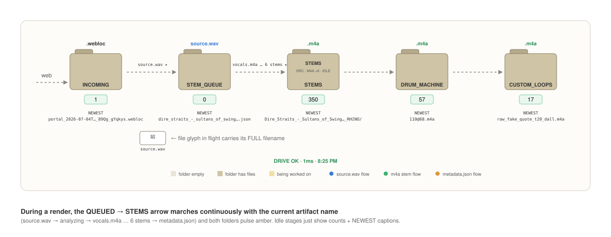

# The Librarian

The Librarian is the Mac mini that runs 24/7 at home. It never plays a note
— its job is to keep the library fed and consistent so the Performer laptop
has nothing to do at a gig but play. The Librarian:

- watches for new YouTube URLs and downloads the audio (once, ever, per
  song),
- analyzes each song's BPM and key and writes its metadata,
- rebuilds the library index (`CATALOG.json`) whenever anything changes,
- pulls the band's Google Sheet song list daily (singers, required
  members, drum patterns, readiness) and rebuilds the sheet-driven gigs,
- keeps itself up to date without anyone touching it.

The Librarian **never runs Demucs** (the 8 GB mini can't), and the
Performer never runs the ingest watcher. They meet in the shared Drive
folder.

## The dashboard — `/librarian`

Open `http://localhost:3000/librarian`, or click **Librarian** in the
brand chip at the top of the portal (Cmd+Shift+U toggles views). The page
header reads *"curation desk for the simpleStem song library"* and shows
the host name plus a last-update pill that refreshes every 3 seconds — it
turns red if the page hasn't heard from the server for 10 seconds.


*SCREENSHOT: the full /librarian page — Plumbing cards, Living Pipeline, ingest cards*

The page is a stack of sections, top to bottom:

### Plumbing

*"Drive must be live for everything else."* Three status cards:

- **Google Drive** — reachability and response time of the Drive folder.
- **CATALOG.json** — row count and freshness of the library index.
- **MPB Sheet Sync** — result of the last Google Sheet pull (matched and
  unmatched row counts).

### Living pipeline

The animated heart of the page: five folders drawn as actual folders —
**INCOMING** (`INCOMING_WEBLOC`), **STEM_QUEUE**, **STEMS**,
**DRUM_MACHINE**, **CUSTOM_LOOPS** — connected by arrows, fed live by
server events.

- **Folders open when they hold files** — the flap lifts, a count badge
  shows how many, the three most recent filenames sit inside, and a
  "newest" line names the latest arrival. Click any folder to copy its
  disk path.
- **Files fly.** When a file actually moves through the pipeline — a
  `.webloc` arriving from the web, a `source.wav` landing, stems being
  written — an icon carrying the **full filename** flies along the arrow
  from one folder to the next, and the arrow pulses.
- **Render progress dots.** The STEMS folder shows the
  most-recently-touched song with one **blue dot** for `source.wav` and
  **six green dots** for the six stem m4as, filling in as each artifact
  lands — you can watch a Demucs render complete dot by dot.
- **Health tick.** *"DRIVE OK · Nms"* with a checkmark that flashes once a
  minute when the Drive health probe runs.
- **Artifact ticker.** A persistent "Latest artifacts:" line under the
  animation — blue chips for fresh YouTube pulls, green chips for finished
  stem encodes — so you can scan recent history without watching every
  frame.


*SCREENSHOT: the Living Pipeline mid-render — STEMS folder open, three green dots filled, a filename in flight*

### Ingest pipeline

Four cards: **INCOMING_WEBLOC** (pending drops), **STEM_QUEUE** (queued
jobs), **Currently processing** (the active song and its render phase),
and **Render failures** (count on record — triage them at
[`/failed-renders.html`](09_TROUBLESHOOTING.md#a-render-failed)).

### Pending & recent

Three listings: pending weblocs, queued render jobs, and the last 10
songs rendered.

### Library statistics

**Songs**, **Artists**, **With lyrics**, and **Missing metadata** (songs
with a blank title or artist), all computed from `CATALOG.json`.

### Active tasks

Every scheduled background job with a **countdown bar ticking to its next
run** — the hourly catalog rebuild, the daily sheet sync, the Drive health
probe, the auto-update check. A card flashes when its job fires.

### Library

The full on-disk library as a searchable table: Title, Artist, BPM, Key,
Singer, **Stems** (health, shown as `N/6`), Folder. Rows color-code by
completeness — green 6/6, amber partial, red 0/6. The search box matches
title, artist, singer, folder name, **and stem health**: type `0/6` to
list every song with no stems, or a stem name like `piano` to find songs
missing that stem. Next to the search box is a **Paste a YouTube URL to
enqueue…** field with an **Enqueue** button — you can feed the pipeline
without leaving the dashboard.

### Librarian daemons

The background services on the mini, with status:

- **Watcher** — `webloc_watch.sh`, the ingest loop.
- **Cataloger** — the hourly `catalog.py` pass.
- **Catalogwatch** — the reactive rebuild (fires within ~5 s of any
  change in the stems folders).
- **MPB Sync** — the daily Google Sheet pull.
- **Auto-update** — the git-pull loop (below).

A collapsible **Raw state JSON** dump sits at the bottom for debugging.

## Auto-update — nobody touches the mini

The Librarian keeps itself current unattended. The auto-update service
periodically pulls the latest code from GitHub; when new code lands, the
services restart themselves. The dashboard page polls the server's build
version every 60 seconds and **reloads itself** when the version changes —
so the browser tab that's been open on the mini for a month is always
showing the current UI. Push code from the Performer, and the mini follows
on its own.

## librarian.sh — the control script

Run on the **mini**, from the code checkout:

```
cd ~/simpleStem-code
./librarian.sh start
./librarian.sh status
./librarian.sh logs
./librarian.sh stop
```

Extras:

```
./librarian.sh catalog
./librarian.sh sheet
./librarian.sh sheet --dry-run
./librarian.sh sheet --master-only
```

`catalog` runs the index consistency pass immediately instead of waiting
for the hour. `sheet` runs the Google Sheet sync now; `--dry-run` previews
without writing; `--master-only` skips the per-gig tabs. Unmatched sheet
rows are reported to `LOGS/mpb_sync_report.json` for triage — the sync
never creates songs or starts renders on its own.

One hard rule: **never run the render queue on the mini.** Demucs needs
more memory than the machine has; that's the whole reason the Performer
renders. (The scripts now guard against this by hostname.)
