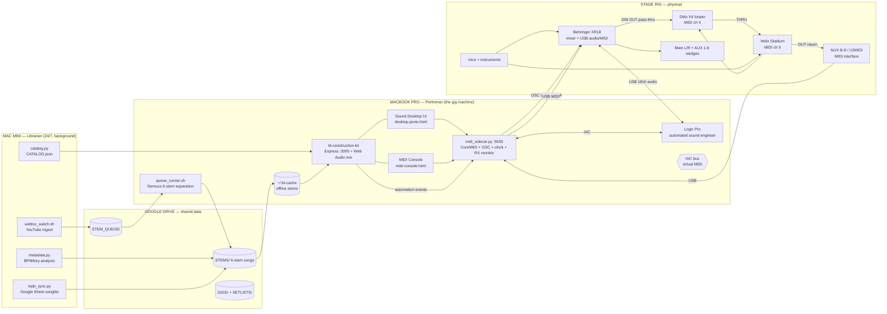

# simpleStem system architecture — the whole rig, one picture

Date 2026-07-18. This is the map behind the Sound Desktop UI: every
system, every wire, and how they interact. The desk
(`/desktop-proto.html`) is a live drawing of this diagram; the MIDI
Console (`/midi-console.html`) is its control room.

## The architectural diagram

Interactions that DON'T exist matter too: the Librarian never runs
Demucs (8 GB RAM), the portal never reads Drive in the audio hot path
(offline-gig contract — everything plays from `~/.bt-cache`), and the
browser never touches MIDI or OSC directly — every message goes through
the sidecar.

## What you're looking at in the GUI

The Sound Desktop is the system as a desk of objects. The left column
is the Mac mini's background world (Librarian robot, ingest queue,
songlist sheet, catalog). The center is the Performer laptop: the
pipeline machines (Stemcutter — one song in, six stems out — Tagger,
Gig Binder, Library, Cache) and below them the stage rig, drawn with
live wires: yellow XLR audio, green USB, blue dashed MIDI control.
Every object obeys three gestures — hover peeks inside it, double-click
opens the real thing behind it (a Finder folder, X-AIR-Edit, Logic, the
Stadium app), right-click lists its executable methods. The
**perimeter is the instrumentation**: the right rack column holds each
physical device's full command map with live green/amber/red status,
the bottom dock summarizes every subsystem, and the wire log streams
every MIDI/OSC message sent and heard, decoded into plain English.
Nothing on screen is a mock-up; every number is polled from the running
system.

## The components, their acronyms, and how they tie together

**MIDI** (Musical Instrument Digital Interface, 1983) is the common
tongue: 16 channels per cable, messages like **CC** (Control Change — a
numbered knob, 0–127) and **PC** (Program Change — "load preset N").
The physical connector is **DIN** (Deutsches Institut für Normung — the
round 5-pin plug). Our devices divide the channels: XR18's chart owns
1–3 (dormant), the Ditto is hard-wired to 4, the Stadium is set to 5.
**MIDI clock** is a metronome on the wire — 24 **PPQN** (pulses per
quarter note) — which the sidecar broadcasts so the Ditto's loop
lengths and the Stadium's delays lock to the portal's tempo.

**CoreMIDI** is macOS's MIDI plumbing; **Audio MIDI Setup** (its MIDI
Studio window) is the Apple tool where devices appear and where the
**IAC** driver lives — Inter-Application Communication, a virtual MIDI
cable between apps on the same Mac. Enabling "Device is online" created
`IAC Driver Bus 1`, which is how the portal's timeline automation and
note/PC senders reach Logic Pro without any hardware. The Python
sidecar (`midi_sidecar.py`) sits on top of CoreMIDI via **mido** +
**python-rtmidi** and is the single owner of all MIDI traffic: HTTP in
(:5555), MIDI/OSC out.

**OSC** (Open Sound Control) is MIDI's network-age successor: named
paths like `/lr/mix/fader` with typed values, carried over **UDP**
(User Datagram Protocol) to the XR18 on port 10024. Because Bill runs
the board in **USB-DIN Pass Thru** mode — which turns the XR18 into a
pure MIDI interface and makes the mixer itself deaf to MIDI — OSC is
the *only* control path to the board, over a static Ethernet link
(192.168.87.1 ↔ .2, replacing the self-assigned **APIPA**/link-local
169.254 addresses). **X-AIR-Edit** is Behringer's own editor app,
speaking the same OSC; the desk opens it on double-click.

The remaining tools: **Demucs** (the ML source-separation model that
saws a song into six stems), **yt-dlp** (fetches the source audio),
**ffmpeg** (transcodes to fast-start m4a), **Express/Node** (the portal
server), **Web Audio API** (the browser mixes six stems live),
**AppleScript/osascript** (types Logic's own key commands — Record,
Play — into the app), and **Google Drive** (data sync between the two
Macs, never in the audio hot path).

## The instrumentation

The instrumentation answers one question — *is the system telling the
truth?* — with three layers. **Verdicts**: every device shows one of
four honest states (ONLINE ✓ own port · CHAINED ⛓ reachable-by-channel
but unproven · CHAINED ✓ loop-verified · OFFLINE ✗), computed by one
shared function so no two surfaces can disagree. **The wire log**: the
sidecar records every outbound message at transmit time and runs a
background listener on every input, so the log shows the full
conversation — `→SENT ch4 CC3=127 · Ditto L1 rec/dub/play`, `←HEARD
OSC /xinfo [...]` — timestamped to the tenth, host-identified, decoded
from the device charts. **Active probes**: the OSC deep-probe reads the
board's identity and levels every minute, and the DIN loop test sends a
marker (CC119 on channel 16, which nothing owns) around the physical
chain and listens for its echo — one number (round-trip ms) that proves
every cable and every Thru switch at once. Hover any panel for its
explanation; the full method-by-method test plan is
`docs/15_DESK_METHOD_TEST_PLAN.md`.
